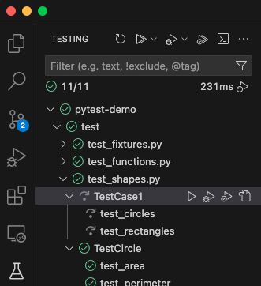
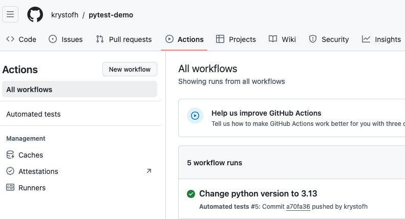

# Automated testing using pytest

Demo of `pytest` framework and Github actions for testing Python code


## Deployment

Create virtual environment:

```shell
python3 -m venv .venv
```

Activate:
```shell
source .venv/bin/activate
```

Install packages using `requirements.txt` file:

```shell
pip install -r requirements.txt
```

## Commands

Include print statements in the test output:
```shell
pytest -s
```

Test only specific marks

```shell
pytest -m slow
pytest -m "not slow"
pytest -m "smoke or regression"
```

## Files

1. Create a subdirectory in the project workspace (root folder), such as `/test`. 
2. Create `__init__.py` file there
3. Name all files with the prefix `test_` or the suffix `_test.py`

> [!NOTE]
> Exception is `conftest.py`

## Functions

Test function names begin with `test_` prefix in order to be recognised automatically by pytest as test functions. Define "standalone" test functions like this:

```python
# Test functions from source/functions.py
import pytest
from source import functions

def test_subtract():
    assert functions.subtract(32, 4) == 28
    assert functions.subtract(32, -2) == 34
```

## Classes

- test class names start with `Test` prefix such as `TestRectangle` or `TestShape`
- use `setup_method` for constructors and other steps to do prior to testing
- use `teardown_method` for cleaning up after the test (deleting objects)
- define test functions inside the class or somewhere else

```python
# Define test class for testing Rectangle class
class TestRectangle:
    # Method used to initialize class objects and prepare the testing
    def setup_method(self, method):
        self.rectangle = shapes.Rectangle(3, 4)  # example object

    # Method used to clean up after tests
    def teardown_method(self, method):
        del self.rectangle  # delete object after use

    def test_area(self):
        assert self.rectangle.area() == self.rectangle.width * self.rectangle.height
```

## Fixtures

Fixtures provide a fixed baseline so that tests execute reliably and produce consistent, repeatable, results. Initialization may setup services, state, or other operating environments. These are accessed by test functions through arguments; for each fixture used by a test function there is typically a parameter (named after the fixture) in the test function’s definition.

>source: https://docs.pytest.org/en/6.2.x/fixture.html

## Definition

```python
@pytest.fixture(
)
def circle_collection() -> list[shapes.Circle]:
    # ...
    return [unit_circle, small_circle, big_circle]
```

## Usage

Use fixture name as test function parameter. This executes the fixtures in the given order prior to the actual test function. 

```python
# Test function using the fixture
def test_circles(circle_collection) -> None:  #  .. AND MORE FIXTURES AS PARAMS IF NEEDED
```

### Accessing fixtures

#### `conftest.py`

Defines fixtures accessible globally within the module

#### Using `scope` parameter

```python
@pytest.fixture(
    scope="module"
)
```

and also adding `import` statement to the respective file like this:
```python
from test.test_fixtures import circle_collection  # Import the fixture
```

### Cleaning up

When teardown is wanted for fixtures, use `yield` instead of `return`:

```python
def circle_collection() -> list[shapes.Circle]:
    # code here
    yield [
        unit_circle,
        small_circle,
        big_circle,
    ]  # alternative to return, but enables cleaning up afterwards
    del unit_circle, small_circle, big_circle  # clean-up steps (teardown code)
```

“Yield” fixtures yield instead of return. With these fixtures, we can run some code and 
pass an object back to the requesting fixture/test, just like with the other fixtures. 
The only differences are:
    - return is swapped out for yield.
    - Any teardown code for that fixture is placed after the yield.

Once pytest figures out a linear order for the fixtures, it will run each one up until it
returns or yields, and then move on to the next fixture in the list to do the same thing.
Once the test is finished, pytest will go back down the list of fixtures, but in the reverse order, 
taking each one that yielded, and running the code inside it that was after the yield statement.

>source: https://docs.pytest.org/en/6.2.x/fixture.html

## Marks

### Skip

```python
@pytest.mark.skip(reason="Showcase of skip mark, delete if needed")
class TestCase1:
    # Test function using the fixture imported from test_fixures.py
    def test_circles(self, circle_collection) -> None:
        for circle in circle_collection:
```

This leads to the test being skipped:



### Xfail

When we know that a test fails but do not care about it as for now, `xfail` mark can be used:

```python
@pytest.mark.xfail(
        reason="Using fake perimeter calculation to demonstrate expected fail mark"
    )
```

The result then appears as `xfailed` or `x` in the statistics:

```
test/test_functions.py ....                                              [ 35%]
test/test_shapes.py ......xss                                            [100%]

=================== 11 passed, 2 skipped, 1 xfailed in 0.05s ===================
```

### Custom marks

For definition of custom marks, one has to create `pytest.ini` file in the project workspace (root directory). This looks as follows:

```ini
[pytest]
markers =
    smoke: Quick, essential tests to verify the core functionality.
    regression: Tests for ensuring no new bugs in existing features.
    slow: Tests that take a long time to run.
```

The marker can be added as before:

```python
@pytest.mark.smoke  # add custom mark
```

Running tests with a custom mark only:

```shell
pytest -m smoke
```

The `.ini` file is recognised and the tests deselected, see results:

```
configfile: pytest.ini
collected 14 items / 13 deselected / 1 selected 
```

Usage of marks can include logical operators:

```shell
pytest -m "not slow"
```

## Parametrisation

Instead of using for loops, it is preffered to parametrize the tested values and results like this:

```python
@pytest.mark.parametrize(
    "minuend, subtrahend, difference", [(32, 4, 28), (32, -2, 34), (1, 2, -1)]
)
def test_subtract_parametrized(minuend, subtrahend, difference):
    assert minuend - subtrahend == difference
```

## Mocking behavior

Use mocking of return values, if:

- you need to isolate the code under test by replacing external dependencies
- obtaining real values is computationally heavy or slow
- if the actual values depend on APIs that can provide inconsistent results (server down, database changed etc.)
- if the usage of API is not economical (costs per request)

Mocking affects only the duration of the test. After the test:
- The mocked function (e.g., `requests.get`) returns to its original behavior.
- This ensures isolation between tests.

### Usage

The `@mock.patch` decorator is used to replace a function (e.g., `requests.get`) with a mock during the test. This allows you to control its behavior:

```python
import unittest.mock as mock
from source import service

@mock.patch("requests.get") # use patch decorator to mock a command
def test_todo_mocked(mock_get): # give the patch a name
    mock_response = mock.Mock()  # Create a mock object
    # Set the content of the mock
    mock_response.status_code = 200
    mock_response.json.return_value = [
        {
            "userId": 1,
            "id": 1,
            "title": "prepare the tutorial",
            "completed": False,
        },
    ]
    mock_get.return_value = mock_response  # Mock requests.get's return value

    data = service.get_todos()  # Call the function under test
    # Assert statements
    # ....
```

 **Key Points:**
1. `@mock.patch("requests.get")`
   - Replaces `requests.get` with a mock object during the test.
2. `mock_response.json.return_value`:
   - Simulates the `json()` method's return value on a real `requests.Response`.
3. Control Behavior:
   - By setting `mock_get.return_value`, you can dictate how `requests.get` behaves in your tests

### Example: Testing a `TypeError`

Another example: Simulating an error in which server responds with wrong data. Checking that the function raises an error as expected.

In the tested function from `service.py` , check of correct type is implemented:

```python
def get_todos():
    response = requests.get("https://jsonplaceholder.typicode.com/todos")
    if response.status_code == 200:
        # Raise TypeError if the data is not packed in a list
        if type(response.json()) != list:
            raise TypeError
        return response.json()
    raise requests.HTTPError
```

The error handling can be tested like this:

```python
# Demonstrate raising exceptions as expected
@mock.patch("requests.get")
def test_todo_mocked_typeerror(mock_get):
    mock_response = mock.Mock()
    mock_response.status_code = 200
    # Pack the response as a dict with single entry instead of list like [{"userId": ...}]
    mock_response.json.return_value = {
        "userId": 1,
        "id": 1,
        "title": "prepare the tutorial",
        "completed": False,
    }
    mock_get.return_value = mock_response
    # Check that TypeError is being raised
    with pytest.raises(TypeError):
        data = service.get_todos()
```

**Key Points:**
1. **Custom Response**:
   - The response is mocked as a dictionary instead of a list.
2. **Error Handling**:
   - Use `pytest.raises` to assert that a specific exception is raised.


## GitHub actions

Enables defining automated CI/CD pipelines and executing the tests on a server in a Docker container. Logs and results automatically appear in the [repository's actions tab](https://github.com/krystofh/pytest-demo/actions):



To define a workflow:

1. Create `.github/workflows` folder in the root directory
2. Create empty `tests.yml` file
3. Give the workflow a name and define on which action to execute:
   ```yaml
    name: Automated tests
    on:
    - push
    - pull_request
   ```
4. Define a job constisting of `setup-python` action for a specified version, like `3.13` here. Then install dependencies in the next step and finally execute the tests with a defined pass condition:

```yaml
jobs:
  test: 
    runs-on: ubuntu-latest
    steps:
      - uses: actions/checkout@v2
      - name: Set up Python
        uses: actions/setup-python@v2
        with:
          python-version: '3.13'
      - name: Install dependencies
        run: |
          python -m venv .venv
          source .venv/bin/activate
          pip install --upgrade pip
          pip install -r requirements.txt
      - name: Run Pytest
        run: |
          source .venv/bin/activate
          pytest --maxfail=5 --disable-warnings
```

> [!NOTE]
> If you want to include a badge stating the pipeline status, include an svg image from the link with the template `REPOSITORY-URL/actions/workflows/tests.yml/badge.svg` like:

```

```

## Links

- [Freecodecamp.org pytest tutorial](https://www.youtube.com/watch?v=cHYq1MRoyI0)
- [Tutorial on Github actions](https://www.youtube.com/watch?v=DhUpxWjOhME)
- [pytest documentation](https://docs.pytest.org/en/6.2.x/contents.html)
- [Github actions documentation](https://docs.github.com/en/actions)
